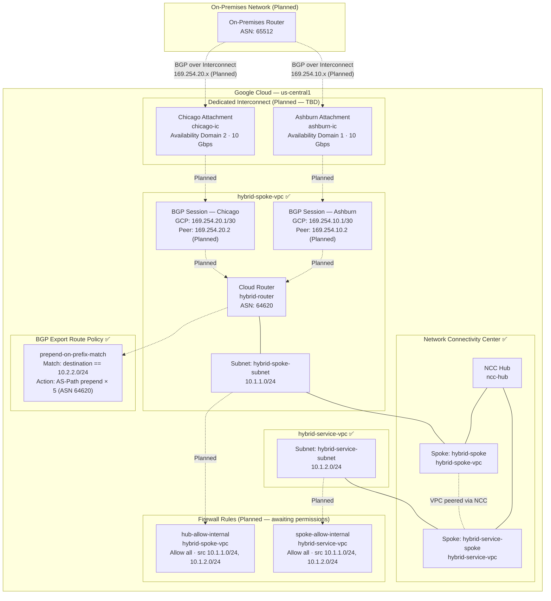
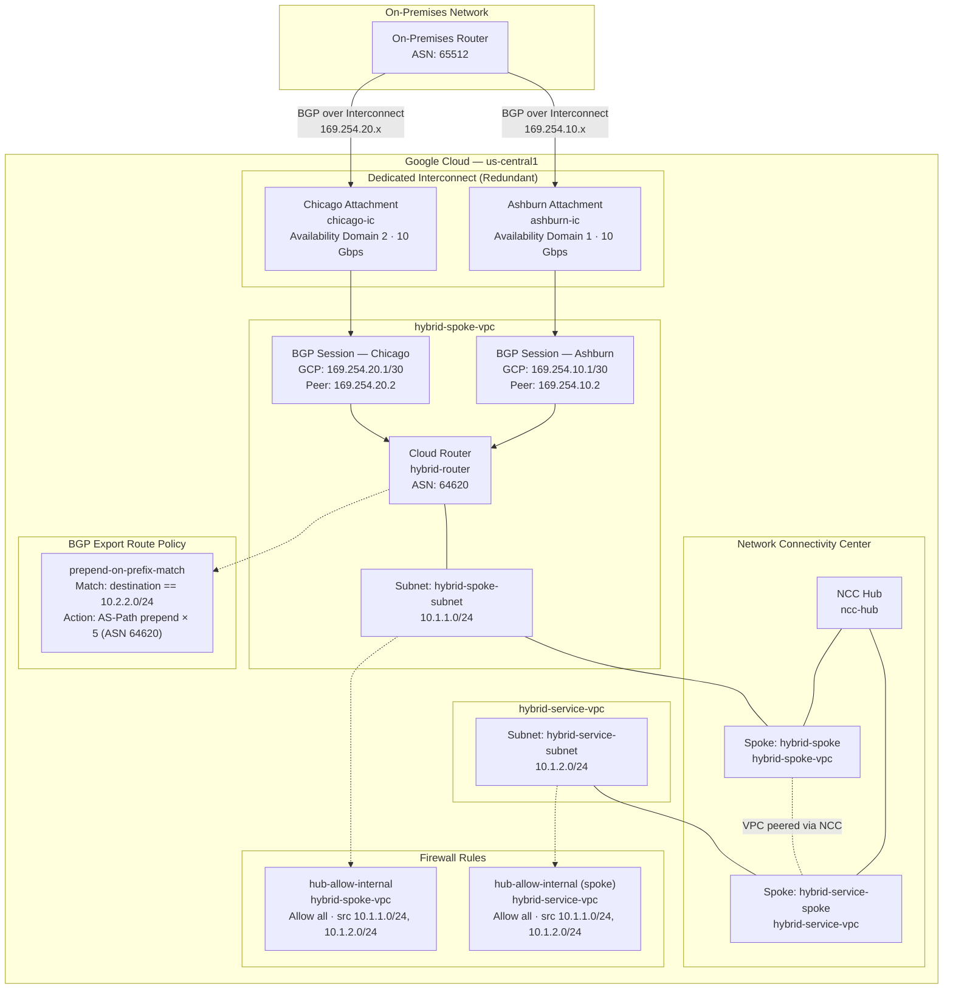

# GCP Hybrid Network (gcp-hybridnet)

Terraform configuration for a Google Cloud hybrid networking topology using **Dedicated Interconnect**, **Cloud Router (BGP)**, and **Network Connectivity Center (NCC)**.

---

## Architecture Overview



> **Legend:** ✅ Deployed &nbsp;|&nbsp; Dashed lines = planned / not yet active

---

## Resources

### VPC Networks (`network.tf`) ✅

| Resource | Name | CIDR | Region |
|---|---|---|---|
| VPC | `hybrid-spoke-vpc` | — | global |
| Subnet | `hybrid-spoke-subnet` | `10.1.1.0/24` | us-central1 |
| VPC | `hybrid-service-vpc` | — | global |
| Subnet | `hybrid-service-subnet` | `10.1.2.0/24` | us-central1 |

### Network Connectivity Center (`network.tf`) ✅

| Resource | Name | Linked VPC |
|---|---|---|
| NCC Hub | `ncc-hub` | — |
| Spoke | `hybrid-spoke` | `hybrid-spoke-vpc` |
| Spoke | `hybrid-service-spoke` | `hybrid-service-vpc` |

NCC enables transitive connectivity between `hybrid-spoke-vpc` and `hybrid-service-vpc` without VPC peering.

### Cloud Router & BGP Export Policy (`router.tf`) ✅

| Resource | Name | Detail |
|---|---|---|
| Cloud Router | `hybrid-router` | VPC: `hybrid-spoke-vpc`, ASN: `64620` |
| Route Policy | `prepend-on-prefix-match` | EXPORT · match `10.2.2.0/24` · AS-path prepend `64620` × 5 |

This route policy makes `10.2.2.0/24` less preferred when advertised to on-premises, steering return traffic via an alternate path.

### Dedicated Interconnect, Interfaces & BGP Peers (`router.tf`) — Planned / TBD

These resources are defined but commented out pending physical cross-connect provisioning at the colocation facilities.

| Resource | Name | Detail |
|---|---|---|
| IC Attachment | `ashburn-ic` | Dedicated · Availability Domain 1 · 10 Gbps |
| IC Attachment | `chicago-ic` | Dedicated · Availability Domain 2 · 10 Gbps |
| Router Interface | `router-ashburn-interface-01` | `169.254.10.1/30` |
| Router Interface | `router-chicago-interface-01` | `169.254.20.1/30` |
| BGP Peer | `ashburn-peer` | Peer IP: `169.254.10.2`, Peer ASN: `65512` |
| BGP Peer | `chicago-peer` | Peer IP: `169.254.20.2`, Peer ASN: `65512` |

> Uncomment these blocks in `router.tf` once the physical interconnects are established.

### Firewall Rules (`firewall.tf`) — Planned / Awaiting Permissions

Commented out pending `compute.firewalls.create` IAM permission. Both rules allow all protocols between the two subnets to enable cross-VPC communication via NCC.

| Resource | Applied VPC | Protocol | Source Ranges |
|---|---|---|---|
| `hub-allow-internal` | `hybrid-spoke-vpc` | all | `10.1.1.0/24`, `10.1.2.0/24` |
| `spoke-allow-internal` | `hybrid-service-vpc` | all | `10.1.1.0/24`, `10.1.2.0/24` |

> Grant the `compute.securityAdmin` or `compute.networkAdmin` role, then uncomment the blocks in `firewall.tf`.

---

## Variables

| Variable | Default | Description |
|---|---|---|
| `project` | — | GCP project name |
| `project_id` | — | GCP project ID |
| `region` | `us-central1` | Deployment region |
| `router_asn` | `64620` | Cloud Router BGP ASN |
| `peer_asn` | `65012` | On-premises BGP ASN (overridden in `terraform.tfvars` to `65512`) |

> **Note:** `terraform.tfvars` should not be committed to version control as it contains project-identifying values.

---

## Providers

| Provider | Version |
|---|---|
| `hashicorp/google` | `>= 7.18.0` |
| `hashicorp/tls` | — (proxy from env) |

---

## Usage

```bash
# Initialise providers
terraform init

# Preview changes
terraform plan

# Apply
terraform apply
```

---

## Deployment Status

| Component | Status | Blocker |
|---|---|---|
| VPCs & Subnets | ✅ Deployed | — |
| NCC Hub & Spokes | ✅ Deployed | — |
| Cloud Router | ✅ Deployed | — |
| BGP Export Route Policy | ✅ Deployed | — |
| Firewall Rules | ⏳ Pending | Requires `compute.firewalls.create` permission |
| IC Attachments | ⏳ Pending | Physical cross-connects not yet provisioned |
| Router Interfaces & BGP | ⏳ Pending | Depends on IC attachments |

---

## File Structure

```
.
├── firewall.tf      # VPC firewall rules (commented out — awaiting IAM permissions)
├── import.tf        # (commented) import blocks for pre-existing resources
├── network.tf       # VPCs, subnets, NCC hub and spokes
├── providers.tf     # Google and TLS provider configuration
├── router.tf        # Cloud Router, route policy; IC/BGP blocks commented out (TBD)
├── terraform.tfvars # Variable values (do not commit — contains project identifiers)
├── variables.tf     # Input variable declarations
└── README.md        # This file
```

Terraform configuration for a Google Cloud hybrid networking topology using **Dedicated Interconnect**, **Cloud Router (BGP)**, and **Network Connectivity Center (NCC)**.

---

## Architecture Overview



---

## Resources

### VPC Networks (`network.tf`)

| Resource | Name | CIDR | Region |
|---|---|---|---|
| VPC | `hybrid-spoke-vpc` | — | global |
| Subnet | `hybrid-spoke-subnet` | `10.1.1.0/24` | us-central1 |
| VPC | `hybrid-service-vpc` | — | global |
| Subnet | `hybrid-service-subnet` | `10.1.2.0/24` | us-central1 |

### Network Connectivity Center (`network.tf`)

| Resource | Name | Linked VPC |
|---|---|---|
| NCC Hub | `ncc-hub` | — |
| Spoke | `hybrid-spoke` | `hybrid-spoke-vpc` |
| Spoke | `hybrid-service-spoke` | `hybrid-service-vpc` |

NCC enables transitive connectivity between `hybrid-spoke-vpc` and `hybrid-service-vpc` without VPC peering.

### Cloud Router & BGP (`router.tf`)

| Resource | Name | Detail |
|---|---|---|
| Cloud Router | `hybrid-router` | VPC: `hybrid-spoke-vpc`, ASN: `64620` |
| IC Attachment | `ashburn-ic` | Dedicated · Domain 1 · 10 Gbps |
| IC Attachment | `chicago-ic` | Dedicated · Domain 2 · 10 Gbps |
| Router Interface | `router-ashburn-interface-01` | `169.254.10.1/30` |
| Router Interface | `router-chicago-interface-01` | `169.254.20.1/30` |
| BGP Peer | `ashburn-peer` | Peer IP: `169.254.10.2`, Peer ASN: `65512` |
| BGP Peer | `chicago-peer` | Peer IP: `169.254.20.2`, Peer ASN: `65512` |

### BGP Export Route Policy (`router.tf`)

| Policy | Type | Match | Action |
|---|---|---|---|
| `prepend-on-prefix-match` | EXPORT | `destination == '10.2.2.0/24'` | AS-Path prepend `64620` × 5 |

This policy makes the `10.2.2.0/24` prefix less preferred when advertised to on-premises, effectively steering return traffic via an alternate path.

### Firewall Rules (`firewall.tf`)

Both VPCs allow all protocols between the two subnets, permitting cross-VPC communication via NCC.

| Resource | Applied VPC | Direction | Protocol | Source Ranges |
|---|---|---|---|---|
| `hub-allow-internal` | `hybrid-spoke-vpc` | INGRESS | all | `10.1.1.0/24`, `10.1.2.0/24` |
| `hub-allow-internal` ⚠️ | `hybrid-service-vpc` | INGRESS | all | `10.1.1.0/24`, `10.1.2.0/24` |

> ⚠️ Both rules share the same GCP firewall name `hub-allow-internal` — see Known Issues #5.

---

## Variables

| Variable | Default | Description |
|---|---|---|
| `project` | — | GCP project name |
| `project_id` | — | GCP project ID |
| `region` | `us-central1` | Deployment region |
| `router_asn` | `64620` | Cloud Router BGP ASN |
| `peer_asn` | `65012` | On-premises BGP ASN (overridden in tfvars) |

> **Note:** `terraform.tfvars` should not be committed to version control as it contains project-identifying values.

---

## Providers

| Provider | Version |
|---|---|
| `hashicorp/google` | `>= 7.18.0` |
| `hashicorp/tls` | — (proxy from env) |

---

## Usage

```bash
# Initialise providers
terraform init

# Preview changes
terraform plan

# Apply
terraform apply
```

---

## Known Issues / Review Notes

> These were identified during code review and should be addressed before deployment.

1. **Incorrect interconnect attachment references in router interfaces** (`router.tf`):
   - `router-ashburn-interface-01` references `google_compute_interconnect_attachment.ashburn_ic.name`
   - `router-chicago-interface-01` references `google_compute_interconnect_attachment.chicago_ic.name`
   - The actual resource labels are `ashburn_ica` and `chicago_ica` — Terraform will error on plan/apply until corrected.

2. **Duplicate `ip_range` on router interfaces** (`router.tf`):
   - Both interfaces are currently set to `169.254.10.1/30`.
   - The Chicago interface should use `169.254.20.1/30` to match its BGP peer IP `169.254.20.2` and avoid a link-local address conflict.

3. **`peer_asn` default vs tfvars mismatch** (`variables.tf` / `terraform.tfvars`):
   - `variables.tf` declares a default of `65012`, but `terraform.tfvars` sets `65512`.
   - Align the default value with the intended ASN to avoid confusion.

4. **Dedicated Interconnect prerequisite** (`router.tf` comment):
   - The IC attachments (`DEDICATED` type) cannot be fully provisioned until the physical cross-connects are established in the colocation facilities (Ashburn / Chicago). The `google_compute_interconnect` resource (the physical layer) is not yet defined in this configuration.

5. **Duplicate firewall rule name** (`firewall.tf`):
   - The Terraform resource `google_compute_firewall.spoke-allow-internal` sets `name = "hub-allow-internal"`, which is the same GCP name as `google_compute_firewall.hub-allow-internal`.
   - GCP firewall names must be unique per project. This will cause a `terraform apply` error. Rename it to `spoke-allow-internal`.

---

## File Structure

```
.
├── firewall.tf      # VPC firewall rules for inter-subnet communication
├── import.tf        # (commented) import blocks for pre-existing resources
├── network.tf       # VPCs, subnets, NCC hub and spokes
├── providers.tf     # Google and TLS provider configuration
├── router.tf        # Cloud Router, IC attachments, interfaces, BGP peers, route policy
├── terraform.tfvars # Variable values (do not commit — contains project identifiers)
├── variables.tf     # Input variable declarations
└── README.md        # This file
```
