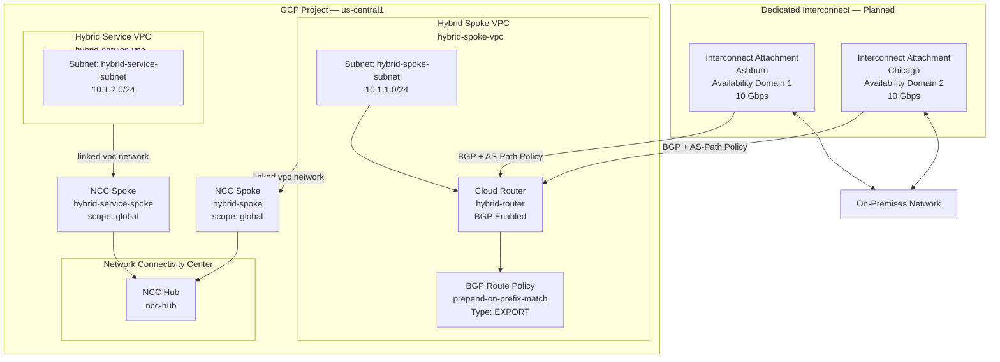
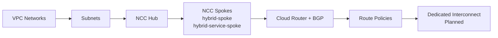

# GCP Hybrid Network — Terraform Architecture

This Terraform configuration provisions a **GCP Hybrid Network** using **Network Connectivity Center (NCC)** as the hub-and-spoke backbone, with a **Cloud Router** and **BGP route policy** providing the foundation for hybrid (on-premises ↔ GCP) connectivity via Dedicated Interconnect.

---

## Architecture Overview



---

## Component Inventory

| Resource | Type | Scope | Description |
|---|---|---|---|
| `hybrid-spoke-vpc` | VPC Network | Global | Primary spoke VPC for hybrid workloads |
| `hybrid-service-vpc` | VPC Network | Global | Secondary VPC for service workloads |
| `hybrid-spoke-subnet` | Subnetwork | us-central1 | Subnet in hybrid spoke VPC — 10.1.1.0/24 |
| `hybrid-service-subnet` | Subnetwork | us-central1 | Subnet in service VPC — 10.1.2.0/24 |
| `ncc-hub` | NCC Hub | Global | Central NCC hub connecting both VPC spokes |
| `hybrid-spoke` | NCC Spoke | Global | NCC spoke linking hybrid-spoke-vpc to hub |
| `hybrid-service-spoke` | NCC Spoke | Global | NCC spoke linking hybrid-service-vpc to hub |
| `hybrid-router` | Cloud Router | us-central1 | BGP-enabled router attached to hybrid-spoke-vpc |
| `prepend-on-prefix-match` | Router Route Policy | us-central1 | Export policy applying AS-path prepend for a specific on-prem prefix |

---

## Network Topology

### Hub-and-Spoke via NCC

Both VPCs are connected to a single **NCC Hub** as globally-scoped spokes. This enables transitive routing between `hybrid-spoke-vpc` and `hybrid-service-vpc` without requiring direct VPC peering.

```
hybrid-spoke-vpc  ──spoke──▶  NCC Hub  ◀──spoke──  hybrid-service-vpc
```

### Hybrid Connectivity (Dedicated Interconnect — Planned)

The Cloud Router (`hybrid-router`) resides in `hybrid-spoke-vpc` and is designed to terminate **two Dedicated Interconnect attachments** — one in Ashburn (Availability Domain 1) and one in Chicago (Availability Domain 2) — providing geographic redundancy for the on-premises path.

```
On-Premises
   ├── Ashburn Interconnect (Domain 1)  ──VLAN attachment──▶  hybrid-router
   └── Chicago Interconnect (Domain 2)  ──VLAN attachment──▶  hybrid-router
```

### BGP Route Policy

An **export route policy** (`prepend-on-prefix-match`) is defined on the Cloud Router. It applies AS-path prepending for a specific on-premises destination prefix, thereby influencing inbound traffic path selection from on-premises (making one path less preferred).

---

## IP Address Plan

| Segment | CIDR | VPC |
|---|---|---|
| Hybrid Spoke Subnet | 10.1.1.0/24 | hybrid-spoke-vpc |
| Hybrid Service Subnet | 10.1.2.0/24 | hybrid-service-vpc |
| On-premises (target prefix) | 10.2.2.0/24 | External / On-prem |

---

## Terraform Providers

| Provider | Version |
|---|---|
| `hashicorp/google` | >= 7.18.0 |
| `hashicorp/tls` | (proxy via environment) |

---

## Deployment Flow



---

## File Structure

| File | Purpose |
|---|---|
| `providers.tf` | Google & TLS provider configuration |
| `variables.tf` | Input variable declarations |
| `terraform.tfvars` | Variable value assignments |
| `network.tf` | VPC networks, subnets, NCC hub and spokes |
| `router.tf` | Cloud Router, BGP config, and route policies |
| `firewall.tf` | Firewall policy definitions (inter-VPC communication) |
| `import.tf` | Import blocks for pre-existing resources |
