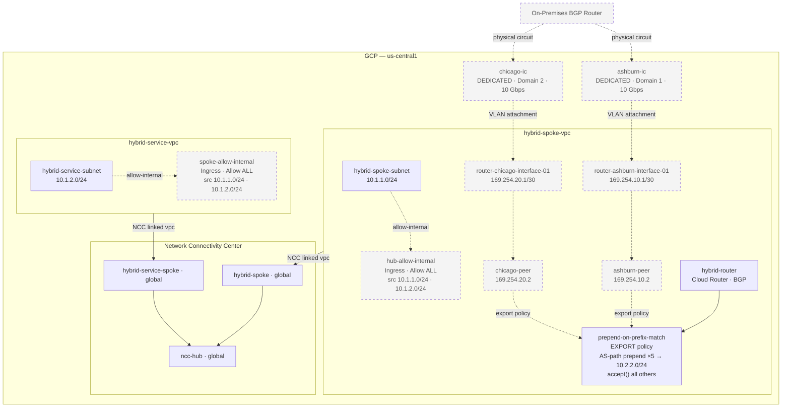
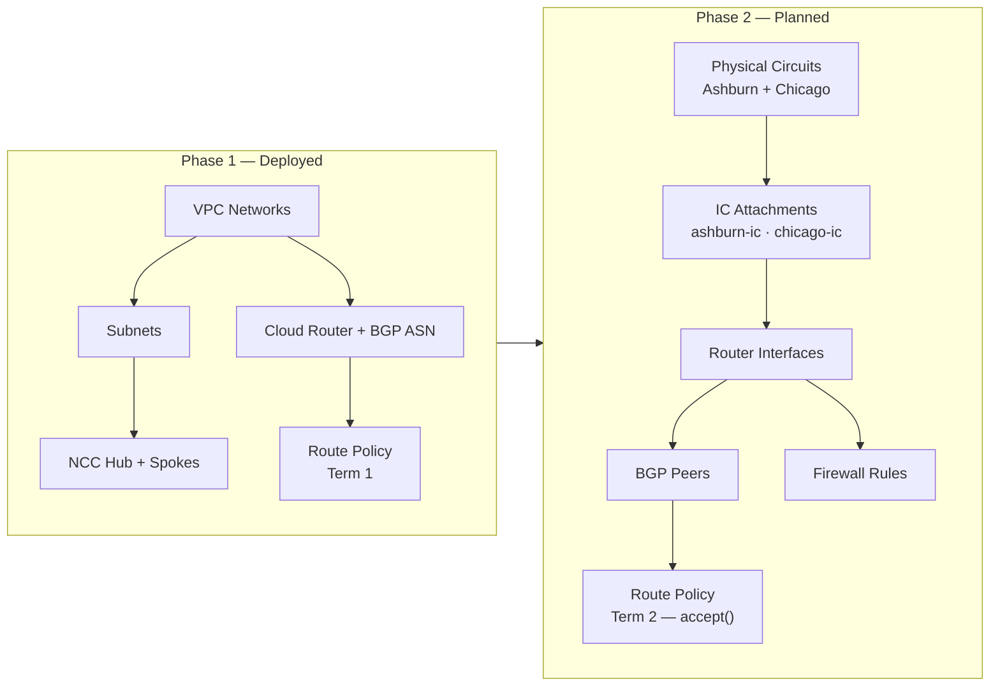

# GCP Hybrid Network — Terraform Architecture

This Terraform configuration provisions a **GCP Hybrid Network** using **Network Connectivity Center (NCC)** as the hub-and-spoke backbone. A **Cloud Router** with **Dedicated Interconnect** attachments and **BGP route policies** provides redundant hybrid connectivity between on-premises and GCP workloads across two VPCs.

> **Diagram legend:** Solid borders and solid arrows = **deployed**. Dashed borders and dashed arrows (`- - ->`) = **planned / not yet provisioned**.

---

## Architecture Diagram



---

## Deployment Status

### Deployed

| Resource | Type | Scope |
|---|---|---|
| `hybrid-spoke-vpc` | VPC Network (custom) | Global |
| `hybrid-spoke-subnet` | Subnetwork | us-central1 · 10.1.1.0/24 |
| `hybrid-service-vpc` | VPC Network (custom) | Global |
| `hybrid-service-subnet` | Subnetwork | us-central1 · 10.1.2.0/24 |
| `ncc-hub` | NCC Hub | Global |
| `hybrid-spoke` | NCC Spoke | Global — linked to `hybrid-spoke-vpc` |
| `hybrid-service-spoke` | NCC Spoke | Global — linked to `hybrid-service-vpc` |
| `hybrid-router` | Cloud Router | us-central1 · BGP ASN configured |
| `prepend-on-prefix-match` (Term 1) | Route Policy — EXPORT | us-central1 · AS-path prepend ×5 for 10.2.2.0/24 |

### Planned (Not Yet Provisioned)

| Resource | Type | Dependency |
|---|---|---|
| `ashburn-ic` | Dedicated Interconnect Attachment — Domain 1 · 10 Gbps | Physical circuit must exist first |
| `chicago-ic` | Dedicated Interconnect Attachment — Domain 2 · 10 Gbps | Physical circuit must exist first |
| `router-ashburn-interface-01` | Router Interface — 169.254.10.1/30 | `ashburn-ic` |
| `router-chicago-interface-01` | Router Interface — 169.254.20.1/30 | `chicago-ic` |
| `ashburn-peer` | BGP Peer — 169.254.10.2 | `router-ashburn-interface-01` |
| `chicago-peer` | BGP Peer — 169.254.20.2 | `router-chicago-interface-01` |
| `prepend-on-prefix-match` (Term 2) | Route Policy Term — accept() all | BGP peers active |
| `hub-allow-internal` | Firewall Rule — `hybrid-spoke-vpc` | IAM permission: `compute.firewalls.create` |
| `spoke-allow-internal` | Firewall Rule — `hybrid-service-vpc` | IAM permission: `compute.firewalls.create` |

---

## Network Topology

### Hub-and-Spoke via NCC

Both VPCs attach to a single globally-scoped NCC hub as VPC network spokes, enabling transitive routing between `hybrid-spoke-vpc` and `hybrid-service-vpc` without direct VPC peering.

```
hybrid-spoke-vpc ──hybrid-spoke──▶  ncc-hub  ◀──hybrid-service-spoke──  hybrid-service-vpc
```

### Hybrid Connectivity (Dedicated Interconnect — Planned)

The Cloud Router is designed to terminate two Dedicated Interconnect VLAN attachments in separate availability domains across two geographic locations, providing geographic HA redundancy for the on-premises path.

```
On-Premises BGP Router
   ├── Ashburn  (Domain 1) ─ 10G ─▶  router-ashburn-interface-01 ─▶  ashburn-peer
   └── Chicago  (Domain 2) ─ 10G ─▶  router-chicago-interface-01 ─▶  chicago-peer
```

### BGP Route Policy — Export (AS-Path Prepend)

The `prepend-on-prefix-match` export policy attaches to both BGP peers and selectively manipulates outbound route advertisements to steer inbound on-premises traffic.

| Term | Priority | Match | Action |
|---|---|---|---|
| 1 ✓ deployed | 100 | `destination == 10.2.2.0/24` | AS-path prepend ×5 — deprioritises this prefix on the peering path |
| 2 ○ planned | 200 | all other destinations | `accept()` — advertise all other prefixes normally |

### Inter-VPC Firewall (Planned)

Both VPCs will carry ingress rules permitting all protocols between the two subnets once the required IAM permission (`compute.firewalls.create`) is available.

| Rule | Network | Source Ranges |
|---|---|---|
| `hub-allow-internal` | `hybrid-spoke-vpc` | 10.1.1.0/24, 10.1.2.0/24 |
| `spoke-allow-internal` | `hybrid-service-vpc` | 10.1.1.0/24, 10.1.2.0/24 |

---

## IP Address Plan

| Segment | CIDR | Location |
|---|---|---|
| Hybrid Spoke Subnet | 10.1.1.0/24 | hybrid-spoke-vpc · us-central1 |
| Hybrid Service Subnet | 10.1.2.0/24 | hybrid-service-vpc · us-central1 |
| Ashburn Router Link-Local | 169.254.10.1/30 | hybrid-router ↔ Ashburn IC |
| Chicago Router Link-Local | 169.254.20.1/30 | hybrid-router ↔ Chicago IC |
| On-Premises Target Prefix | 10.2.2.0/24 | External — on-premises |

---

## Provisioning Sequence



---

## Terraform Providers

| Provider | Version |
|---|---|
| `hashicorp/google` | >= 7.18.0 |
| `hashicorp/tls` | proxy via environment |

---

## File Structure

| File | Purpose |
|---|---|
| `providers.tf` | Google & TLS provider configuration |
| `variables.tf` | Input variable declarations |
| `terraform.tfvars` | Variable value assignments |
| `network.tf` | VPC networks, subnets, NCC hub and spokes |
| `router.tf` | Cloud Router, router interfaces, BGP peers, route policies, and Dedicated Interconnect attachments |
| `firewall.tf` | Inter-VPC ingress firewall rules |
| `import.tf` | Import blocks for pre-existing GCP resources |
